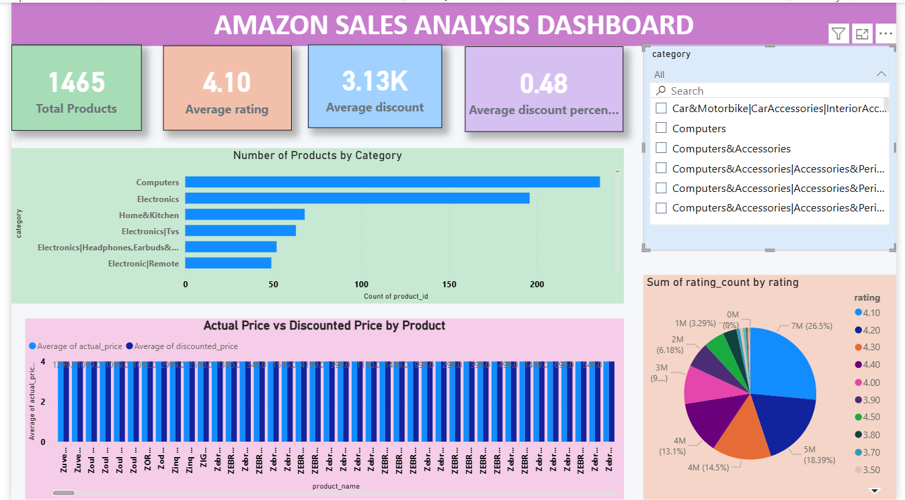
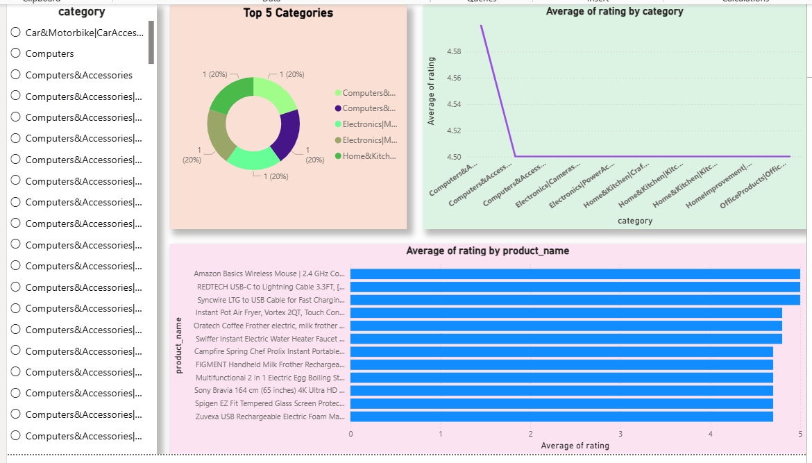

# Amazon Sales Analysis Dashboard – Power BI

## 🧠 The Story Behind This Project
While learning data analytics and exploring datasets, I came across an Amazon product dataset containing information such as product names, categories, prices, discounts, customer ratings, and review counts.

Instead of simply creating charts, I wanted to explore how product data could reveal insights about pricing strategies, discounts, and customer satisfaction.

E-commerce platforms like Amazon generate a huge amount of product data every day. Understanding this data can help businesses identify product trends, pricing patterns, and customer preferences.

Through this project, I aimed to analyze Amazon product data and present meaningful insights using an interactive Power BI dashboard.

This project represents an important step in my journey of learning data analytics and data visualization using Power BI.

---

## 🔍 What This Dashboard Explores

The dashboard focuses on analyzing Amazon product data to understand product performance and customer feedback.

Some of the key questions explored in this project include:

- How many products are available in the dataset?
- Which product categories contain the highest number of products?
- How do actual prices compare with discounted prices?
- Which products receive the highest customer ratings?
- Which categories have the most popular products based on rating count?
- How do discounts vary across different products?

---

## 📈 Key Insights from the Data

After analyzing the dataset, several interesting patterns were discovered:

- Certain product categories contain a higher number of products compared to others.
- Many products offer significant discounts compared to their actual prices.
- Some products maintain high customer ratings despite price variations.
- Rating count helps identify the most popular products among customers.
- Categories with more products tend to show a wider variation in pricing and discount strategies.

These insights demonstrate how data visualization can help in understanding product trends and customer preferences in e-commerce platforms.

---

## 🛠 Tools & Technologies Used

- Power BI Desktop  
- Power Query  
- Data Cleaning  
- Data Visualization  
- Amazon Product Dataset (CSV)

---

## 📊 Dashboard Preview

### Dashboard Overview

### Product Analysis Dashboard

---

## 📚 What I Learned From This Project

Working on this project helped me understand that data analytics is not just about creating charts, but about discovering insights and telling stories using data.

Through this project I learned:

- How to clean and transform raw datasets
- How to create interactive dashboards using Power BI
- How to analyze product data to discover trends
- How to present insights through visual storytelling

This project strengthened my interest in data analytics and business intelligence.

---

## 🚀 What's Next?

This project is the beginning of my journey into the field of data analytics. In the future, I plan to build more projects related to:

- Sales Data Analysis
- Customer Behavior Analysis
- Business Intelligence Dashboards
- Real-world data analysis problems

---

## 💬 Feedback

If you have any suggestions or feedback on how this dashboard can be improved or what additional insights could be explored, I would love to hear your thoughts.

Constructive feedback is always appreciated.

---

## 👩‍💻 Author

**Ujjuri Saisri**  
B.Tech – Computer Science Engineering  
Aspiring Data Analyst  
Power BI | Data Visualization | Data Analytics
